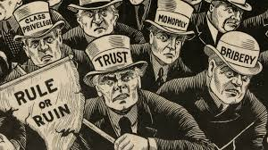
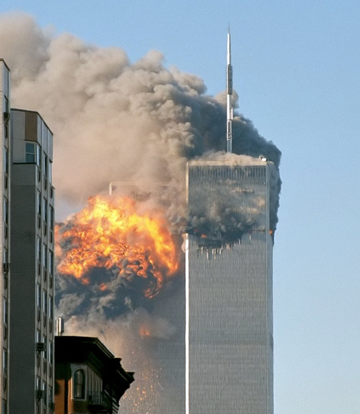

<head>
  <link href="https://fonts.googleapis.com/css2?family=Roboto:wght@400;500;700&display=swap" rel="stylesheet">
</head>

  

  

    <h1 style="font-size: 3rem; margin: 0;">Title</h1>
    
SubTitle

  

<nav style="background-color: #01395E; padding: 10px 0; position: sticky; top: 0; z-index: 1000; display: flex; justify-content: space-between; align-items: center; width: 100%; box-sizing: border-box;">
  

    Title
  

  

    <a href="#introduction-a-century-of-filma-mirror-of-our-lifetimes" style="color: white; text-decoration: none; margin: 0 15px; text-transform: uppercase;">Introduction</a>
    <a href="#dataset" style="color: white; text-decoration: none; margin: 0 15px; text-transform: uppercase;">Dataset</a>
    <a href="#events" style="color: white; text-decoration: none; margin: 0 15px; text-transform: uppercase;">Periods</a>
    <a href="#analysis" style="color: white; text-decoration: none; margin: 0 15px; text-transform: uppercase;">Analysis</a>
    <a href="#conclusion" style="color: white; text-decoration: none; margin: 0 15px; text-transform: uppercase;">Conclusion</a>
    <a href="#team" style="color: white; text-decoration: none; margin: 0 15px; text-transform: uppercase;">Team</a>
  

</nav>

### Introduction: A Century of Film—A Mirror of Our Lifetimes?

The history of cinema is intertwined with the story of humanity. It’s a relatively new art, but since its beginning, it had the aim to portray the life of the people. For decades, the seventh art has reflected social trends, captured time shots, and offered a lens through which we can explore the evolution of our culture. There are so many ways to analyze films but for our team, time and the society in which they were produced seem a good fit! 

WoW, what do I hear? Today we have access to the **CMU film dataset and IMDb metadata** at our disposal, we have the tools to address fascinating questions about films through time:
- Do movies mirror the major events and values of their eras?
- Are genres, themes, or ideas cyclical, or do they evolve linearly?
-	How did historical periods reflect in the plots?
-	Do we see a correlation between major events and film success?

So many questions and no answer for now, let’s take our camera and ACTION! 

---

  <h2 style="text-align: center; text-transform: uppercase; color: black; font-size: 3rem; font-weight: 500;">Dataset</h2>

Let’s see what this dataset looks like! Our dataset is huge! It includes **81’741** films spanning the whole 20th century and the start of the 21st with information such as a movie’s language and country of production, its genres, cast and box office performance as well as a plot description for some. In total, the dataset comprises films from **146** different countries for **210** distinct languages with a large overrepresentation of the USA and the British language . To this, we added audience ratings from IMDB for most films to get an idea of how the public received them. 

  <svg width="600" height="400" xmlns="http://www.w3.org/2000/svg">
  
    <!-- Movies -->
    <circle cx="50" cy="60" r="50" fill="lightblue" />
    <text x="50" y="60" fill="black" font-size="16"  font-weight="bold" text-anchor="middle" dy=".3em">81’741</text>
    <text x="50" y="125" fill="black" font-size="16" text-anchor="middle">movies</text>
  
    <!-- Countries -->
    <circle cx="300" cy="60" r="50" fill="lightgreen" />
    <text x="300" y="60" fill="black" font-size="16" font-weight="bold" text-anchor="middle" dy=".3em">146</text>
    <text x="300" y="125" fill="black" font-size="16" text-anchor="middle">countries</text>
  
    <!-- Languages -->
    <circle cx="550" cy="60" r="50" fill="lightcoral" />
    <text x="550" y="60" fill="black" font-size="16" font-weight="bold" text-anchor="middle" dy=".3em">210</text>
    <text x="550" y="125" fill="black" font-size="16" text-anchor="middle">languages</text>
  
    <!-- Time span -->
    <circle cx="50" cy="260" r="50" fill="lightblue" />
    <text x="50" y="260" fill="black" font-size="16" font-weight="bold" text-anchor="middle" dy=".3em">1</text>
    <text x="50" y="325" fill="black" font-size="16" text-anchor="middle">century</text>
  
    <!-- Periods -->
    <circle cx="300" cy="260" r="50" fill="lightgreen" />
    <text x="300" y="260" fill="black" font-size="16" font-weight="bold" text-anchor="middle" dy=".3em">10</text>
    <text x="300" y="325" fill="black" font-size="16" text-anchor="middle">periods</text>
  
    <!-- Ratings -->
    <circle cx="550" cy="260" r="50" fill="lightcoral" />
    <text x="550" y="260" fill="black" font-size="16" font-weight="bold" text-anchor="middle" dy=".3em">6/10</text>
    <text x="550" y="325" fill="black" font-size="16" text-anchor="middle">average rating</text>
  
  </svg>

  

This dataset is huge, maybe too huge and we need to restrict ourselves. We wish to perform an analysis depending on time periods and the society they represent but how could we compare the thriving society of the United States in the 1920s to South Africa which was still under the rule of the British empire at the time?

To keep a baseline, we focus is on U.S. cinema, which has been a dominant force globally and a significant cultural barometer. The question is not just what people watched but why—and what the times can tell us about that.

Now that we’re set, let's dive into this.

---

  <h2 style="text-align: center; text-transform: uppercase; color: black; font-size: 3rem; font-weight: 500;">Periods</h2>

Click to discover our time cutting
<html lang="en">
<head>
    
</head>
<body>
    <h1>Historical Periods</h1>
    

        <!-- Add a period for each historical event -->
        

            
<strong>The Progressive Era (1900-1914):</strong>

            
            

                At the beginning of the 20th century, the USA were driven by progressivism, a social democratic movement that rose in response to the massive industrialization of the late 19th century. It brought many reforms seeking to improve the conditions of the middle and working classes. This period saw a general improvement of the population’s quality of life with a prosperous economy and a push for social equality and women’s rights.
            

        

        

            
<strong>World War I (1914-1918):</strong>

            
            

                As the first World War erupted, the USA chose to remain neutral. Even though the public opinion was generally more friendly towards the Allies (UK, France, Russia, …) than the Central Powers (Germany, Austria-Hungary, Ottoman Empire, …), they preferred not to engage in battle. However, they still looked to prepare for the possibility of war and strengthened the military powers, especially the Navy. Over time, the American people saw Germany as being increasingly hostile and it was announced in 1917 that the United States were entering the war siding with the Allies. 
            

        

        

            
<strong>The Roaring Twenties (1918-1929):</strong>

            
            

                The 1920s, also known as the Roaring Twenties, saw the USA ending getting out of WW1 as victors and with few economic losses. These years were similar to the Progressive Era in that America continued its economic growth and prosperity. The incomes of working people increased along with those of middle class and wealthier Americans resulting in a increased consumerism. The automobile and electricity industries thrived and radically changed the people’s way of life. But the Roaring twenties are also the start of the prohibition, where the distribution of alcohol became illegal in hope to eradicate alcoholism. However, this did not solve the problem and brought an even greater one as many gangs took over the alcohol market and rapidly grew more and more violent.
            

        

        

            
<strong>The Great Depression (1929-1939):</strong>

            
            

                The Wall Street Crash of 1929 brought an abrupt end to the Roaring Twenties. A lot of people had invested their money on the stock market that was very loosely regulated and as the economy plummeted, they were left with massive debt. This is a period of huge poverty and unemployment as a fourth of the population came jobless by 1933. The whole decade resulted in efforts to gradually recover the economy and employment rate.
            

        

    

    <!-- Row 2 with 3 containers -->
    

        

            
<strong>World War II (1939-1945):</strong>

            
            

                As the second World War began, the industry changed rapidly to support the war effort. The employment rate rose back up and even women joined the workforce to replace the people enrolled in the army. Productivity was increased to match the demands of a growing military force, and a lot of efforts were made to ensure the national unity. In this sense, the movie industry of Hollywood worked an impressive propaganda to consolidate the Americans’ patriotism and resentment towards Germany.
            

        

        

            
<strong>The Early Cold War (1946-1960):</strong>

            
            

                The USA got out of the war as one of the most influential countries in the world along with the USSR. This period was one of high economic growth and prosperity for the American people. Nonetheless, it was also marked by the Red Scare, the fear of the other superpower of that time, The communist USSR. The two nations with radically different political views were competing to see which one would shape the future of the world. As well as providing help to rebuild their allies’ nations in Europe and engaging in wars against communism across the globe, the States embarked on a race both in nuclear armament and on space discovery. Inside the country, a large propaganda was set up against communism and people were prosecuted if they were too far on the left political wing. 
            

        

        

          
<strong>The Civil Rights Movement (1960-1970):</strong>

          
          

              The Civil Rights Movement of the 50s and 60s saw the African American population fight to promote racial equality and the rights of the black people. It was a moment of great social changes that confronted the United States to the incoherences of their self-proclaimed position of leaders of the democracy. This mostly non-violent movement led by figures such as Martin Luther King Jr., Malcolm X or Fannie Lou Hamer brought the abolition of many discriminative laws and laid a legal groundwork to promote equality and civil rights. This period also saw the culmination of the space race as, in 1969, Neil Armstrong became the first human to set foot on the moon
          

        

    

    <!-- Row 3 with 3 containers -->
    

        

          
<strong>The Late Cold War (1971-1991):</strong>

          
          

              As the Cold War continued, the USA slowly but surely gained the upper hand against the USSR. The American economy was growing steadily while communism started to show its economical flaws. At the same time, many pro-peace movements rose in America as the population was fed up with the many conflicts around the globe in which the States were involved. Conflicts such as the Vietnam war angered the population that didn’t understand why American people had to die so far from their home.
          

        

        

          
<strong>The Post-Cold War and the New World Order (1992-2001):</strong>

          
          

              The end of the Soviet Union in 1991 left the United States as victors of the Cold War and established them as the only superpower of the world. In a world entering globalisation and the starting years of internet, the American culture thrived and influenced the whole world. If there was no communism to fight, the US army was still present in many regions of the world to serve their interests. For example, many soldiers were sent in the Arabic peninsula because of the large reserves of Oil present in the region.
          

        

        

        
<strong>The War on terrorism (2001-present):</strong>

        
          

            The attacks of the 11th of September shocked the world and even more so the United States. They discovered a new kind of war they weren't ready for, terrorism. The enemy could be pretty much anyone, and there was no clear way to counterattack. This brought a lot of fear and distrust to the population, and the USA started a more self-centred politic and restricted the access inside their borders and.
          

        

    

    
</body>
</html>

---

  <h2 style="text-align: center; text-transform: uppercase; color: black; font-size: 3rem; font-weight: 500;">Analysis</h2>

## Genre-ally Speaking: A Plot Twist in Movie History



This graph visualizes the evolution of movie themes from 1900 to 2020, showing the total number of movies for each theme over the years. It highlights the early prominence of "Short/Silent" films, with a sharp peak followed by a decline, while genres like "Action/Adventure/Thriller" and "Drama/Mystery" grew in prominence in later years. Additionally, the graph displays the evolution of other themes such as "Black and White", "Romance", "Musical", "Horror/Crime", "Science Fiction/Fantasy", "Historical/Biographical/Documentary", and "Independent/Experimental/LGBT". We will analyze some of these themes in more detail shortly.

<table style="width: 90%; border-collapse: separate; table-layout: fixed;">
  <tr>
    <td style="width: 35%; word-wrap: break-word; padding-right: 15px;">
      
    </td>
    <td style="width: 35%; word-wrap: break-word; padding-left: 15px;">
      
    </td>
  </tr>
</table>

<table>
  <tr>
    <td>
      
    </td>
    <td>
      <strong>Short/Silent Films:</strong>  
        In the early days of cinema, short and silent films dominated due to simple technology, universal accessibility, and their novelty, which attracted large audiences. Peaking around 1920, their popularity declined sharply with the rise of sound in the late 1920s, which transformed filmmaking and diminished the appeal of silent films.  
        

      <strong>Black-and-White Films:</strong> 
        Black-and-white films dominated early cinema due to the lack of affordable color technology, peaking around 1940. Their decline after 1960 coincided with the widespread adoption of color film, which made black-and-white less popular. However, a resurgence after 2000 reflects its enduring appeal as an artistic and stylistic choice for filmmakers. 
        

      <strong>Independent/Experimental/LGBT Films:</strong> 
        The scarcity of independent, experimental, and LGBT films before 1980 reflects production constraints and censorship. Their rise after 1980 aligns with social movements and cultural shifts, fostering diverse voices and enabling filmmakers to explore unconventional themes and artistic approaches.
    </td>
  </tr>
</table>

<table>
  <tr>
    <td>
      <strong>Drama/Mystery:</strong>  
        The gradual increase in drama and mystery movies may be attributed to the timeless appeal of these genres. These themes explore fundamental human experiences and stories that remain relevant across generations, which sustains audience interest. The peak between 2000-2010 could be influenced by changing social contexts which lead to different types of stories that become popular, as well as a general trend in movie production across all genres.
        

      <strong>Action/Adventure/Thriller:</strong> 
      The sharp rise in action, adventure, and thriller films after 1970 is likely due to advancements in special effects, which made it possible to produce more spectacular and visually engaging films in these genres. 
        

      <strong>Comedy:</strong> 
      The early peak of comedy in the 1940s may be due to the popularity of "screwball comedies" during the Great Depression and World War II as a form of escapism.  The later peak for comedy around 2000, similar to other genres, is likely the result of the general increase in movie production.
    </td>
    <td>
      
    </td>
  </tr>
</table>



This graph illustrates the evolution of movie themes over time, depicting the number of movies for each theme. It highlights the rise and fall of various themes, such as the decline of "Short/Silent" films and the growing popularity of genres like "Action/Adventure/Thriller", "Drama/Mystery", and "Comedy".


This graph illustrates the changing proportions of movie themes across different historical periods, such as "The Belle Époque," "World War I," and "The War on Terror." It highlights how themes like "Short/Silent" films dominated earlier periods, while genres such as "Action/Adventure/Thriller," "Drama/Mystery," and "Comedy" became more prominent in later times.


This matrix provides a quick visual overview, allowing for the identification of groups of historical periods with similar thematic patterns, as well as highlighting periods with distinctively different thematic trends.

---
## Lets see what we are talking about !
Even if we rather watch a film than just read about it, we have here acces to beautiful summaries already processed by some magic NLP algorithms. I know , I know this is old school.. you'd prefer to watch some trailer, but here we can learn a lot from these summaries. What do they tell us ? Can we identify any trends across different eras? Are there any particular patterns or particularities?
So many questions and yet no anwser but lets dive into text.

  

For this textual analysis we took the whole processed summaries corpus and tried to do a general classification between films and the eras we picked. This map is made based on common words that we think are deeply related to a perdiod and if the sum of these words pass a certain treshold well ... We classify them as such !
Here are some Wordclouds based one each periods. These are common words from the films using TF-IDF.

  

    
  

  

    
  

  

    
  

  

    
  

  

    
  

  

    
  

Some terms are expected other less but do these classified films and wordclouds match their own periods or are they reccurent through years ? We can also highlight some topics thanks to LDA method to see if there are similarities between periods. 

For example here if we focus on temporality for films classified on war on terror we see the huge rise after the 2001 attacks on World Trade Center , but we also see some outliers with film already putting terrorism subject on the camera. 
Howver as expected we see that this subject is a modern one as it its present only in recent times through the plots

  

There is significant variability, indicating that historical events have long been a source of inspiration for movie directors. Even today, filmmakers continue to explore these themes, offering their own unique perspectives on pivotal moments in history.

### Causal Inference

To compare attributes of films from different time periods, we wanted to engage in causal inference to understand whether observed differences in film characteristics were truly due to the time period itself, or if they were influenced by other factors.

[Causal inference](https://en.wikipedia.org/wiki/Causal_inference) allows us to draw more reliable conclusions about the effect of a specific factor (in this case, the time period) on film attributes, rather than just identifying correlations. However, in observational data like ours, where films from different time periods are not randomly assigned, (hidden) covariables might be influencing both the period and the outcomes (such as genre trends, budgets, or technological shifts). Without controlling for these covariates, any conclusions about the impact of the time period could be misleading.

In an attempt to address this issue, we turned to [propensity score matching](https://en.wikipedia.org/wiki/Propensity_score_matching) (PSM). PSM helps us create comparable groups by matching films from different time periods that have similar characteristics, in this our case, genre and ratings (budget data was too sparse to be representative). By doing so, we can try to isolate the impact of the time period itself, reducing the bias introduced by the covariates. In theory, PSM allows us to mimic a randomized controlled experiment, where films from different periods are as similar as possible, except for their time of production.

We used logistic regression to estimate the propensity scores for each film, which represent the likelihood of a film being produced in a specific time period based on its genre and ratings. We then matched films from different periods based on these scores, using maximum weight matching (the PS as the weights), creating comparable groups for analysis. All our code is available in the [GitHub repository](https://github.com/epfl-ada/ada-2024-project-metal2024/tree/main/src/causal_inference). 

Our second issue, which we did not address in this analysis, is that the maximum weight matching algorithm we used is O(n³), which makes it computationally expensive for large datasets. To remediate this, we uniformly sampled a subset of the data for our analysis, which could introduce some bias, and some variance. We picked a the biggest subset we could, and added the number of movies for each period in the title of each graph to give an idea of the representativity of our sample.

#### Named Entity Recognition

Our [movie corpus dataset](http://www.cs.cmu.edu/~ark/personas/) included a [Stanford Core-NLP](https://www.wikidata.org/wiki/Q32998961) processed plot summary containing [named entities](https://en.wikipedia.org/wiki/Named-entity_recognition). We used this information to identify the most common entities mentioned in the plot summaries across different time periods. These named entities could provide insights into the dates, characters, locations, lexical information about time, money, durations and more.

  

The films from the Civil Rights Movement has some interesting `ORGANIZATION` named entities, such as `Times`, which could be linked the the [New York Times](https://en.wikipedia.org/wiki/The_New_York_Times), but also `King` which could be linked to [Martin Luther King Jr](https://en.wikipedia.org/wiki/Martin_Luther_King_Jr.). `Armstrong` could be linked to the musician [Louis Armstrong](https://en.wikipedia.org/wiki/Louis_Armstrong) who won awards in the 1960s, but it is unlikely that it is also linked to the astronaut [Neil Armstrong](https://en.wikipedia.org/wiki/Neil_Armstrong), as he step foot on the moon in 1969, with films taking years to be produced. All of which the Great Depression time period doesn't have. Other entities such as `Sharks` remain hard to interpret.

  

Still comparing the `ORGANIZATION` named entities, we see that both World War II and Post Cold War periods have Nazi Germany related entities, which could be due to films about the war being released, for some of them, after the war. The second time period interestingly introduces new entities, although they are hard to interpret.

  

Unfortunately, the results were not as insightful as we had hoped. Most Named Entities were too sparse to draw meaningful conclusions, and the most common ones were generic and not specific to any time period. Results between more periods and more named entities can be found in our repository.

#### NGrams and TF-IDF

[NGrams](https://en.wikipedia.org/wiki/N-gram) are another way to analyze text data, capturing the most frequent sequences of words that can provide context and meaning. Unfortunately these didn't provide meaningful insights for our analysis, as the most common n-grams were generic and not specific to any time period. 
To remedy this, we ranked 1-3 grams not by their plain frequency in the plots for the films from a given time interval but according to their [TF-IDF](https://en.wikipedia.org/wiki/Tf-idf) score. This allowed us, in theory, to identify the most important words for each time period, based on their frequency in the plots and their rarity in the whole corpus.

  

The word `new` is slightly more present in the Late Cold War than in the Post-Cold War, but we can't draw any meaningful conclusions from this, as it also could be due, for example, to the mention of `New York` or `New World City` in the plots.

  

Strangely, the word `war` was more present during movies from the Roaring Twenties than during World War II. `american` is more present in the second than in the first.

Again, the results were not as insightful as we had hoped. Most of the top TF-IDF n-grams were in all time periods, and the differences were not significant enough to draw meaningful conclusions. This could be due to the nature of the movie plots, which often contain similar elements regardless of the time period. Results between more periods can be found in our repository.

## Movie ratings, another metric for popularity ?
Cinema is art, and as all art, people can like it, or hate it. Nowadays cinephiles have letterboxed accounts telling everyone their favourite movies. However this has not always been the case, just a few years ago the biggest movie ratings aggregator was IMDB, where people ranted about the latest movie they disliked, or conversly praised an old unknown movie from 50 years ago they found in a videoclub. One idiom often coming back is "It was better before", and cinema is not an exception. The top 100 movies from the [American Film Institute](https://www.afi.com/afis-100-years-100-movies-10th-anniversary-edition/) does not contain a single movie after 2000, and the vast majority of them came out before the 70s. Are movies worse nowadays or do people just want to appear special by showing off their cinematc culture of old movies ?

For this part we will use the ratings from the IMBD dataset, which we added to the movies of our dataset. Additionally, we'll receive the help from multiple detectives that accepted to help us in this hard mission. 
We've already seen he number of movies that came out each year, but now let's see which one of those have a rating: 


**Good news, it seems we have a fair amount of data !** This means we will be able to get useful insights without relying to much on assumptions because of missing data. The only problematic years are around 2007 where we have some missing ratings but drastically outscaled by the huge amount of movies with ratings and the 1915s where the movies without ratings outnumber the movies with a rating. We'll keep this in mind when comparing the early periods with later ones in our analysis. 
<table>
  <tr>
    <td>
    The first detective to jump in is sherlock, a wise man that never gets thrown off by numbers. One important thing he tells us is that a rating is worth nothing without the number of votes. When he arrives at a crime scene, he always judges the number of witnesses, and their claims. We takt that into account and plot the sum of all votes for each year, and the average votes per movie. Thanks sherlock !
    </td>
    <td>
      
    </td>
  </tr>
</table>



Indeed Sherlock was right, the total number of votes increases drastically over the years (notice the log scale !) and the mean number of votes per movies also. Again, this means analysing older movies, especially before the 1960s will have to be put in context. 

<table>
  <tr>
    <td>
      
    </td>
    <td>
Now that we know this, let's dive into the ratings themselves, and plot them over the years. A friend of us, Detective Pikachu does not like uncertainty. When he does a pika pika attack de foudre la he always hits, so due to the high variability of ratings, he tells us to use errorbars. Between two thunderbolds dans le cul de l'adversaire, he mentions something about weighting the rating for each year. That seems like a good intuition; movies with a lot of ratings should impact their average consequently. We computed this weighted average by multiplying each movie's rating with thge number of votes for said movie.
    </td>
  </tr>
</table>



  

**What a Surprising Result!! Even detective pikachu is thrown off guard** From 1913 on, the weighted movie rating is constantly better than the average. Even more than that, it's outside the error-bars ! This can only mean one thing. The rating of a movie, and the number of votes is not totally uncorrelated. The year 1973 seems to be the best year in terms of weighted rating, but just any normal year in mean ratings, there must be a reason!

<table>
  <tr>
    <td>
    This task requires deeper understanding, we'll ask a person that always has the right tools to analyse data: Inspector Gadget. Luckily he has exactly what we need, a way to compute correlation. If we find any correlation between the ratings and the number of votes, it might explain why the weighted average is so off the mean. Using his multiple arms, Inspector Gadget gives us the Pearson Correlation coefficient which captues linear correlation, and the Spearman capturing non-linear monotonic correlation. 
    </td>
    <td>
      
    </td>
  </tr>
</table>



Indeed, there is something going on here, the year 1973 seems has much more correlation than the average data, and year 1949 even more ! Mister gadget advises us to plot the number of votes against the rating of a movie, he gives a last tool to only use with caution before leaving, we'll keep it preciously. 



<table>
  <tr>
    <td>
    <strong>Ugh that's so ugly, we need to do something about that! </strong>
    We're sorry mister Gadget, but it's already the time to use your secret tool. But we'll do it with extreme caution.
      <strong>We will forever remember the words from Miss Sakota:</strong>
    </td>
    <td>
      
    </td>
  </tr>
</table>

With the Greatest caution, we use the log scale given by Mr Gadet, hoping it will make this graph useful in any way. 



Indeed this is much more readable, there's so much to say. First let's understand this plot correctly, because as a real detective would do, we will analyze every detail of it in later parts, to get the whole meaning of it. First we can see that most of the movies are concentrated in the center, between 200 and 10k votes. Since there are som many of them it's hard to detect any particular tendency, but one thing we notice is that that's the range where we have the most movies under a rating of 4. Above 100k, the movie ratings seem to be increasing, until we only have a few movies above 1M votes, which all have a rating above 8. On the other side, we notice that the only few movies with a rating above 9, have less than 200 votes, and they are practically unknown. However this plot is still to dense, let's get back to our example years from before: 



Indeed the distribution for the 3 chosen years is not the same at all, just look at the huge amount of movies below 4 in 2006. Even though they do not have that many ratings, they still add up. And now take advantage of the interactive plot and zoom on The right side of the plot. First we'll notice that no single movie from 1949 has more than 50k votes. Ans also notice the difference in distribution between 1973 and 2006. In 1973, all movies above 20k votes have a rating of at least 6.9, no wonder the weighted average is so high !

<table>
  <tr>
    <td>
      
    </td>
    <td>
A familiar face jumps in, telling us that we should click on the 2006 label on the right to turn off the movies of that year, and dive deep into a more precise comparison between 1949 and 1973. We would like to understand why 1949 has a higher spearman coefficient. Looking at the points the 1973 seem sparser, and 1949 seems practically linear, so why is the pearson coefficient so low ? Columbo's sharp mind answers before we could een think about it: Because of the log scale. Here the correlation is not linear, but logarithmic, that's why the spearman coefficient is higher, as it captues the monotonic increase of the logarithm. 
    </td>
  </tr>
</table>

However Columbo's not totally happy with our analysis, saying we lack some overview. He's right, let's come back to our original problem: Comparing periods. 

(Pas sur de celui la, il est pas ouf je trouve, on pourrait peutetre tout jarter jusquà Genre popularity)

When averaged over periods, the differences are suddenly much smaller, but let's try to see a difference between the early and late cold war, that even though very near politically, have a slight difference in average and weighted ratings: 


Again this phenomena of having more movies with a worse rating is present for the late cold war, where it is not the case for early cold war. Again don't limit yourself to the periods that are shown on screen at the moment, and play around by comparing multiple other periods. 

### Genre popularity over the years

<table>
  <tr>
    <td>
Let's come back to a lead we had earlier: Comparing genres and movie themes, this time using their popularity over the selected periods. Hercule Poirot has been around for quite a while now, and he even starred in a Black-and-White Movie Alibi in 1931. He probably knows if we can see the decline of the 3 most popular themes in the early years ? And how did Silent or Black-and-White movies age ? Hercule as wise as always tells us to also plot the weighted rating over all themes, or we wouldn't be able to do any comparisons. 
    </td>
    <td>
      
    </td>
  </tr>
</table>



This plot is very informative, we can see that during the early years, the 3 genres are very close to the general score, which makes sense since these were practically the only genres to come out, however as the time went to, they started diverging a lot. Remember during the periods in the middle, we had practically no movies of these genres that were coming out, so the data is quite empty. I'd advise digging deeper into the difference between the very bad independent movies of the great depression and the astonishingly good Black-and-White movies that came out in the Post-Cold War. That seems like a hard task, let's send an experimented detective: **Du-Du Du-Du Du-Du Du-Du Batmaaaaaan !**



  

Thanks god we're saved, it was just a False alarm. Steven's Spielberg "Schindler's List" completely changed the weighted rating with his rating of 9 and 1.4 million votes. When we remove that movie the weighted rating for "Black-and-White" movies in the Post-Cold War goes down to 7.5: a value slightly above average, but not shocking. Thanks Batman, we were about to draw wrong conclusions

Okay now that we found this outlier, let's go back to the most produced genres Today: Drama, Action/Adventure and Comedy. How did the popularity evolve for these movies ? The AFI's top 100 list has so many dramas that came out before the 90s, does that mean that Drama's nowadays are bad ? And What about Comedy and Action movies. If there are so many of those, they are probably popular right ?


Indeed The drama movies seem to be very reliable. Always above average, especially compared to Comedies that are probably dragging down the average. Action movies on the other side seems to be just good enough, but with a deline sonce the second world war. If we take a closer look at the AFI's top 100 movies list, Citizen Kane, and Casablanca should appear for the second world war in the category drama, and comparing it to a period where Comedy's are below average we might find out the secret of Drama Movies to stay so high in rating



<table>
  <tr>
    <td>
For this final task we'll be helped by James Stewart, playing his detective role in Vertigo (9th in AFI's top 100 list !). He tells us to some insights about cult movies: They age very well ! And the more people watch them, the more peope like them. It's simple, no massively rated movie has a bad rating in AFI's list. 
Indeed look at these different disributions, nothing comparable ! The difference on the lower right part of the curve, where we have so many comedies performing well below Dramas with similar number of votes. Even though the Comedy theme has 2 movies outperforming the Classics Citizen Kane, and Casablanca, the big amount of Comedies with bad ratings lower the average. So why do comedies perform so bad ? James starts telling us the answer, but as he speaks, our sight starts spinning and a strong nauseau hits us. The answer was probably too hard to swallow, and gave us vertigo. 
    </td>
    <td>
      
    </td>
  </tr>
</table>

Je sais pas quoi dire pour conclure ?? 

---

### Conclusion

And now, here we are at the end of our journey through time.
Our journey through cinema's rich history has offered a fascinating lens from the silent beginnings to the globalized blockbuster era, movies have acted as mirrors through analyzing trends, genres, and audience responses across decades. Although the dataset was difficult to manipulate to find causality or direct link between periods and group of films we believe we give a nice time overview of what films have been.

---

  <h2 style="text-align: center; text-transform: uppercase; color: black; font-size: 3rem; font-weight: 500;">Team</h2>

# Meet the Team

## Anoush Azar-Pey   
📖 **About:** Anoush is a dataFreak.  

---

## Emilien Silly  
📖 **About:** Emilien brings everything you can imagine.  

---

## Lilly-Flore Celma  
📖 **About:** Lilly-Flore specializes in cinematography.  

---

## Mathis Krause   
📖 **About:** Mathis is passionate about Tadao Ando.  

---

## Timo Michoud   
📖 **About:** Timo excels in NLP pre-processing.  

